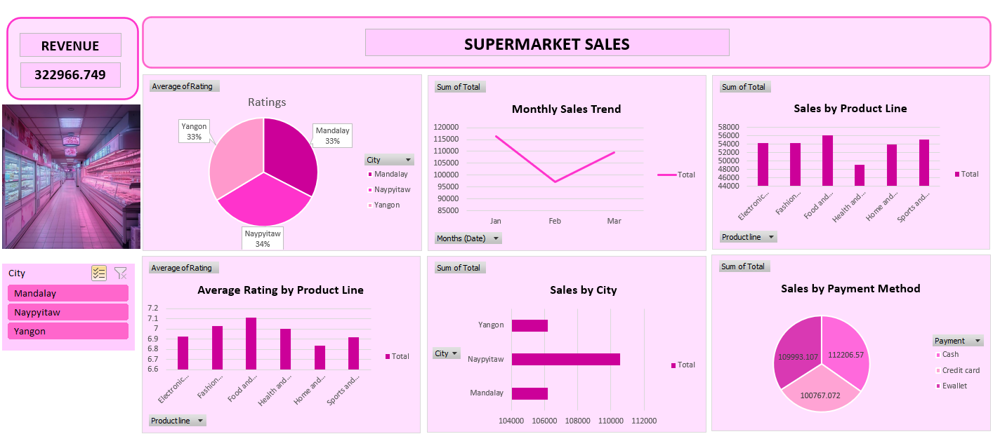

# Supermarket_Sales_Dashboard

## Introduction
This dataset contains sales information from a supermarket chain, covering various aspects of their business operations, such as sales by product line, city, payment method, and customer ratings.

## File Description
The data is stored in an Excel file named supermarket_sales_dashboard.xlsx and includes several sheets, each focusing on different aspects of the sales data.

## Sheet Descriptions
Sales by Product Line: Contains data on sales categorized by different product lines.

Sales by City: Provides sales figures for each city where the supermarket operates.

Sales by Payment Method: Details sales based on the payment method used by customers.

Average Rating by Product Line: Displays the average customer rating for each product line.

Monthly Sales Trend: Shows the trend of sales on a monthly basis.

Average of Rating by City: Provides average customer ratings per city.

Raw Data: Contains the unprocessed raw sales data.

DB: This sheet appears to be either empty or contains irrelevant data.

## Data Fields
Each sheet contains various fields relevant to its category. For example, the "Sales by Product Line" sheet might include fields such as Product Line, Total Sales, and Quantity Sold.

## Usage Instructions
Opening the File: Use any spreadsheet application like Microsoft Excel or Google Sheets to open and explore the data.
Analyzing Data: Each sheet can be analyzed to derive insights into sales performance, customer preferences, and operational efficiency.

## DATA STORY :- THE DASHBOARD PRESENTS THE PERFORMANCE OF THE SUPERMARKET'S SALES ACROSS VARIOUS DIMENSIONS SUCH AS PRODUCT CATEGORY AND LOCATION. NAYPYITAW HAS MORE SALES THAN THE OTHER STORES.  FOOD AND BEVERAGES PRODUCT CATEGORY HAS HIGHEST RANGE OF REVENUE.
  
# Dashboard
 &nbsp;
